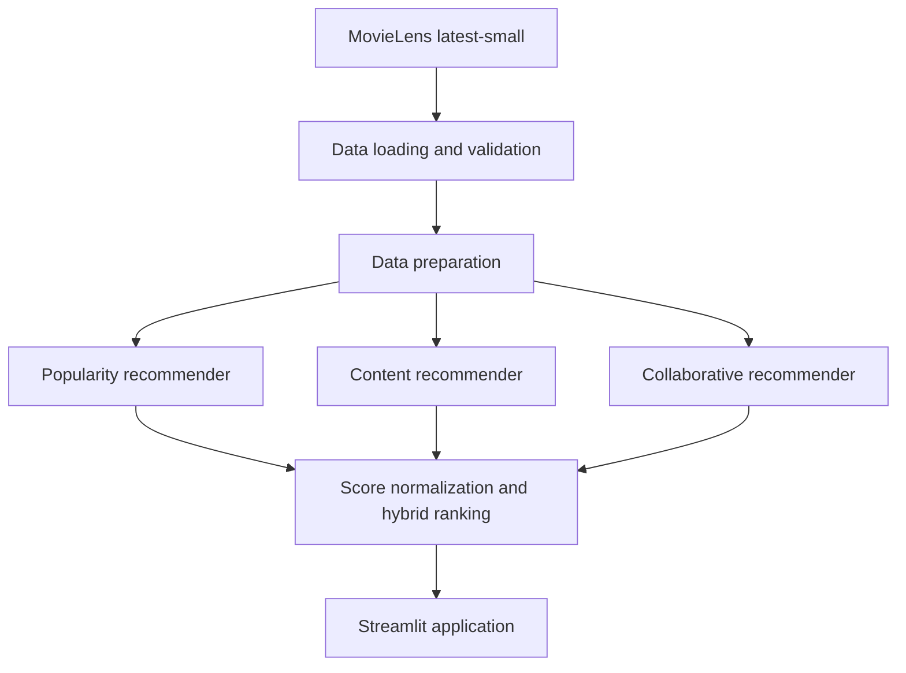

# CineMatch — Hybrid Movie Recommendation System

[](https://github.com/arunkumararavindhakshan05-sudo/netflix-hybrid-recommender/actions/workflows/ci.yml)
[](https://www.python.org/)
[](https://netflix-hybrid-recommender-gqv3exappfqwt5zuhmq4wpx.streamlit.app/)
[](https://docs.astral.sh/ruff/)

CineMatch is an end-to-end movie recommendation application that combines content similarity, collaborative filtering, and audience popularity. It provides personalized recommendations through a responsive Streamlit interface inspired by modern streaming platforms.

**Live application:** [Launch CineMatch](https://netflix-hybrid-recommender-gqv3exappfqwt5zuhmq4wpx.streamlit.app/)

> This is an independent educational and portfolio project. It is not affiliated with, endorsed by, or connected to Netflix.

## Table of contents

- [Business problem](#business-problem)
- [Solution overview](#solution-overview)
- [Key features](#key-features)
- [System architecture](#system-architecture)
- [Recommendation approaches](#recommendation-approaches)
- [Technology stack](#technology-stack)
- [Project structure](#project-structure)
- [Dataset](#dataset)
- [Local setup](#local-setup)
- [Quality assurance](#quality-assurance)
- [CI/CD](#cicd)
- [Deployment](#deployment)
- [Limitations and roadmap](#limitations-and-roadmap)

## Business problem

Large movie catalogues create a discovery problem: users need relevant choices without manually browsing thousands of titles. A useful recommendation system should balance personal taste, similarity to known preferences, and broadly trusted titles while avoiding movies a user has already rated.

CineMatch addresses this by combining three complementary signals into a single ranked recommendation experience.

## Solution overview

The application supports three recommendation modes:

1. **Personalized recommendations** for a selected MovieLens user.
2. **Similar-movie discovery** based on movie content.
3. **Popular recommendations** across the complete catalogue or within a genre.

The hybrid model combines normalized scores using configurable weights:

```text
hybrid_score =
    collaborative_weight × collaborative_score
  + content_weight       × content_score
  + popularity_weight    × popularity_score
```

The interface allows these weights and the number of recommendations to be adjusted interactively.

## Key features

- Hybrid ranking using collaborative, content-based and popularity signals
- Personalized recommendations for known MovieLens users
- Exclusion of movies already rated by the selected user
- Similar-title recommendations using TF-IDF and cosine similarity
- Genre-aware popularity recommendations
- Graceful handling of unknown users and cold-start scenarios
- Automatic download and validation of the MovieLens dataset
- Interactive Streamlit interface with adjustable hybrid weights
- Automated unit tests and code-quality checks
- GitHub Actions continuous integration
- Public deployment on Streamlit Community Cloud

## System architecture



## Recommendation approaches

### Popularity-based recommendations

Ranks movies using rating volume and average rating. This provides a reliable fallback for new or unknown users and supports genre filtering.

### Content-based recommendations

Transforms movie metadata into TF-IDF features and calculates cosine similarity between titles. It recommends movies that are structurally similar to a title the user enjoyed.

### Collaborative filtering

Uses the user–movie rating matrix and matrix factorization with Singular Value Decomposition (SVD) to learn latent preference patterns. Predictions are generated for unseen movies, while previously rated titles are removed from the final result.

### Hybrid recommendations

Normalizes and combines the three component scores. Configurable weights make the trade-off between personalization, similarity and general popularity transparent.

## Technology stack

| Area | Technology |
|---|---|
| Language | Python 3.12 |
| Data processing | pandas, NumPy |
| Machine learning | scikit-learn, SciPy |
| Model persistence/utilities | joblib |
| Visualization | Matplotlib, Seaborn |
| Web application | Streamlit |
| Dependency management | uv |
| Testing | pytest |
| Linting and formatting | Ruff |
| CI/CD | GitHub Actions |
| Hosting | Streamlit Community Cloud |

## Project structure

```text
netflix-hybrid-recommender/
├── .github/
│   └── workflows/
│       └── ci.yml
├── .streamlit/
│   └── config.toml
├── artifacts/
│   └── eda/
├── data/
│   └── ml-latest-small/
├── src/
│   ├── __init__.py
│   ├── collaborative_recommender.py
│   ├── content_recommender.py
│   ├── data_loader.py
│   ├── data_preparation.py
│   ├── download_data.py
│   ├── eda.py
│   ├── hybrid_recommender.py
│   └── popularity_recommender.py
├── tests/
│   ├── test_collaborative_recommender.py
│   ├── test_content_recommender.py
│   ├── test_data_preparation.py
│   ├── test_download_data.py
│   ├── test_hybrid_recommender.py
│   ├── test_popularity_recommender.py
│   └── test_setup.py
├── .gitignore
├── .python-version
├── app.py
├── pyproject.toml
├── README.md
└── uv.lock
```

Generated data, caches and environment-specific files are intentionally excluded from version control.

## Dataset

The project uses the [MovieLens latest-small dataset](https://grouplens.org/datasets/movielens/latest/), which contains movie metadata, user ratings, genres and external identifier links.

The application automatically downloads and extracts the dataset when it is not available locally. To prepare it manually, run:

```bash
uv run python -m src.download_data
```

The dataset is stored under `data/ml-latest-small/` and is not committed to Git.

## Local setup

### Prerequisites

- Git
- Python 3.12
- [uv](https://docs.astral.sh/uv/)

### Installation

```bash
git clone https://github.com/arunkumararavindhakshan05-sudo/netflix-hybrid-recommender.git
cd netflix-hybrid-recommender
uv sync --frozen --dev
```

### Run the application

```bash
uv run streamlit run app.py
```

Open `http://localhost:8501` if the browser does not open automatically.

## Quality assurance

Run all automated tests:

```bash
uv run pytest
```

Run the code-quality checks:

```bash
uv run ruff check .
```

Apply safe automatic Ruff fixes when necessary:

```bash
uv run ruff check . --fix
```

The current suite contains **26 passing tests** covering data preparation, dataset acquisition and the popularity, content, collaborative and hybrid recommendation components.

## CI/CD

The GitHub Actions workflow runs automatically for repository changes. It:

1. Checks out the source code.
2. Installs the supported uv environment.
3. Reproduces dependencies from `uv.lock`.
4. Runs Ruff code-quality validation.
5. Executes the automated pytest suite.

A change is considered integration-ready only when the workflow completes successfully.

## Deployment

The production application is hosted on Streamlit Community Cloud:

**[https://netflix-hybrid-recommender-gqv3exappfqwt5zuhmq4wpx.streamlit.app/](https://netflix-hybrid-recommender-gqv3exappfqwt5zuhmq4wpx.streamlit.app/)**

The deployment uses:

- Branch: `main`
- Entrypoint: `app.py`
- Python: `3.12`
- Dependency lockfile: `uv.lock`

Changes merged into `main` are detected by Streamlit Community Cloud and reflected in the deployed application.

## Limitations and roadmap

- Add offline ranking metrics such as Precision@K, Recall@K and NDCG@K
- Add time-aware train/test evaluation
- Add model and data caching for faster cold starts
- Add poster metadata through an optional external API
- Improve mobile-specific responsive styling
- Add container-based deployment support
- Add observability for model latency and recommendation coverage
- Evaluate larger datasets and scalable approximate-nearest-neighbour retrieval

## Acknowledgements

- [GroupLens Research](https://grouplens.org/) for the MovieLens dataset
- [Streamlit](https://streamlit.io/) for application hosting and UI tooling
- The open-source Python data and machine-learning ecosystem

---

Developed by [Arun Kumar](https://github.com/arunkumararavindhakshan05-sudo).
